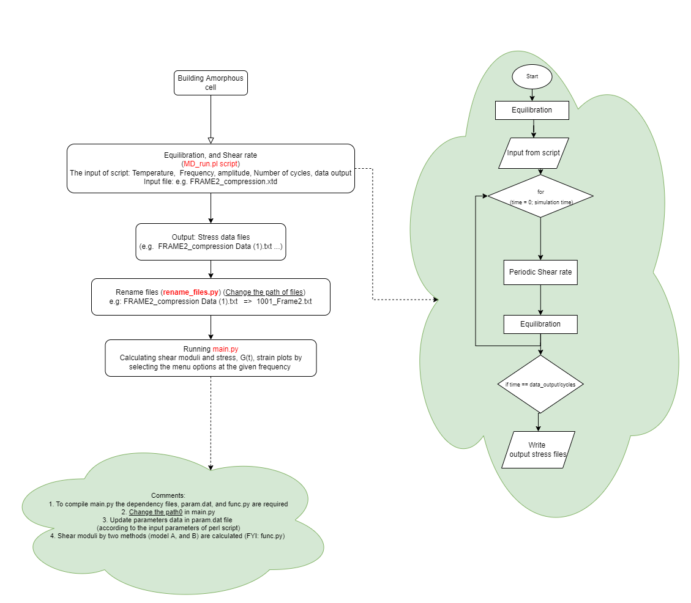

# DMA
This is a package to calculate storage and loss modulus. 

Version DMA.1.0, May, 2022.

If you are using this code, please cite:
Sadollah Ebrahimi, Marc Meunier, and Armand Soldera. Polymer Testing, 111, 2022. 
DOI: https://doi.org/10.1016/j.polymertesting.2022.107585

The storage and loss modulus are calculated using two different methods as gollows:
1. Green-Kubo
2. Stress time series

# Input, Dependency files and Scripts
NEMD processing:

1. Materials Studio® input files: your system + ***MD_run.pl*** : The parameters should be revised according to your purpose

Post processing:

2. ***rename_file.py***
3. ***main.py***
4. ***param.dat*** :  The value of the parameters must be the same as the parameters of the Perl code.
5. ***func.py*** 

*Place all files in the main folder or update the path in the scripts*
# Description and running
How it works: 

1. The periodic shear stresses must be calculated using molecular dynamics simulations, and in the current version, simulations must be conducted in the Materials Studio® environment (As an example see test.pl in the /test directory)
2. According to the flowchart, rename the Materials Studio® output files (text files): ***...(No.).txt => No._...txt*** (As an example, see the ***rename_file.py*** in the test/ directory)
3. Run the main.py in the src directory.
4. Choose the desirable methods to calculate the shear moduli  

